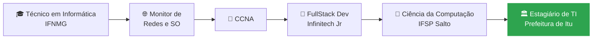

<div align="center">


<a href="https://git.io/typing-svg">
  
</a>

<br/>


</div>

---

## 👨‍💻 Quem sou eu

```python
class Caio:
    nome        = "Caio Emanoel Silva"
    cidade      = "Salto, SP 🇧🇷"
    formacao    = [
        "Ciência da Computação @ IFSP Salto (formatura prevista: 2027)",
        "Técnico em Informática @ IFNMG",
    ]
    trabalho    = "Desenvolvedor FullStack @ Infinitech Jr (desde jul/2025)"
    estagio     = "Estagiário de TI @ Prefeitura de Itu, Secretaria da Educação (desde set/2026)"
    certificado = ["Cisco CCNA", "AWS Cloud Foundation"]
    passado     = "Monitor de Redes e Sistemas Operacionais"
    gosta_de    = ["APIs bem desenhadas", "Docker", "Linux", "maratona de programação", "IA aplicada à educação"]

    def status(self):
        return "Construindo, quebrando, consertando e aprendendo ☕"
```

- 🏢 Na **Infinitech Jr** (empresa júnior) desenvolvo soluções para clientes reais e participo de apresentações e propostas comerciais.
- 🏛️ No **estágio na Prefeitura de Itu** (Secretaria da Educação), atuo com administração de redes, suporte ao desenvolvimento e apoio no laboratório de informática.
- 🏆 Me preparo para **programação competitiva** nas horas vagas.
- 🌐 Vim de **redes e SO**, então entendo o caminho que o dado percorre da requisição até o servidor.

---

## 🛠️ Stack

### Linguagens
<p>
  
</p>

### Frameworks, back e front
<p>
  
</p>

### Dados, infraestrutura e cloud
<p>
  
</p>

### Ferramentas
<p>
  
</p>

<details>
<summary><b>📊 Mapa de conhecimentos (clique para abrir)</b></summary>
<br/>

| Área | O que eu uso | Onde aparece |
|---|---|---|
| **Backend** | Python (FastAPI, Django), Java (Spring), PHP | APIs REST, regras de negócio, autenticação JWT |
| **Frontend** | JavaScript, React, HTML/CSS | Interfaces web e consumo de APIs |
| **Mobile** | Kotlin (Android Studio) | Disciplina de Desenvolvimento Mobile |
| **Bancos de dados** | MySQL, PostgreSQL | Modelagem, JPA/Hibernate, consultas |
| **DevOps e Cloud** | Docker, AWS (EC2, S3, RDS), Linux | Containers, deploy e ambientes de dev |
| **Redes e SO** | CCNA, escalonamento de processos em C | Monitoria, projetos acadêmicos e administração de redes no estágio |
| **Suporte de TI** | Atendimento, laboratório de informática | Estágio na Prefeitura de Itu |
| **Engenharia** | UML, arquitetura em camadas (Controller → Service → Repository) | Documentação e modelagem de sistemas |
| **Dados e IA** | Machine Learning (classificação), feature selection | TCC sobre evasão escolar |

</details>

---

## 🧭 Minha trajetória



---

## 🚀 Projetos em destaque

| Projeto | O que é | Tecnologias |
|---|---|---|
| 🧮 [**escalonador-de-processos**](https://github.com/C4103M/escalonador-de-processos) | Simulador de escalonador de processos com o algoritmo **Round Robin** |  |
| 📄 [**indexador-pdf**](https://github.com/C4103M/indexador-pdf) | App desktop para organizar, categorizar e pesquisar PDFs de forma inteligente |   |
| 💬 [**livechat-furia**](https://github.com/C4103M/livechat-furia) | Ambiente interativo de fãs com chat ao vivo, portal de notícias e mensagens diretas |  |
| 🧩 [**quiz-app**](https://github.com/C4103M/quiz-app) | Projeto de conclusão do curso técnico: jogo web que ajuda a aprender informática |  |
<!-- TROQUE: adicione aqui o repositório da API da oficina (Spring + Docker + JWT) -->
<!-- | 🔧 [**sistema-oficina**](https://github.com/C4103M/NOME-DO-REPO) | API REST para gestão de oficina mecânica, com autenticação JWT e containers |    | -->

---

## 🔭 Em foco agora

- [x] Modelagem UML e arquitetura em camadas de uma API Spring
- [x] Containerização do ambiente com **Docker**
- [x] Início do estágio na **Prefeitura de Itu** (redes, suporte e laboratório de informática)
- [ ] Autenticação com **JWT + BCrypt** e tratamento global de exceções
- [ ] Deploy de uma aplicação na **AWS**
- [ ] Experimentos de ML para o **TCC** (predição de evasão escolar)
- [ ] Evoluir na **programação competitiva**

---

## 📈 Estatísticas do GitHub

<div align="center">


</div>

---

## 🤝 Vamos conversar?

Se curtiu algum projeto, quer trocar ideia sobre APIs, redes, cloud ou ML, ou precisa de um dev para uma ideia, fale comigo:

<p align="center">
  <a href="https://www.linkedin.com/in/caioemanoel36/"></a>
  <a href="mailto:caioemanoel36@gmail.com"></a>
  <a href="https://github.com/C4103M"></a>
</p>

<div align="center">

> *"Funciona na minha máquina"* → *"Funciona no meu container"* 🐳


</div>